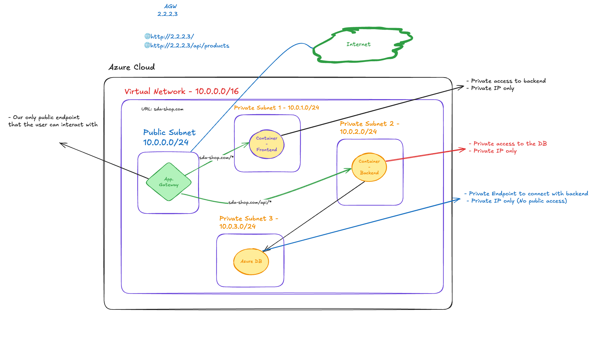
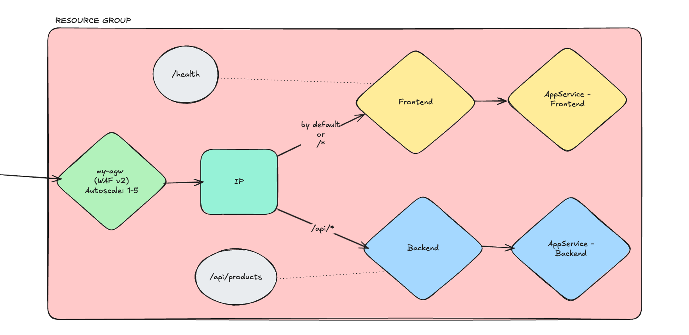

# Azure Three-Tier Deployment of a Containerized Web App

Deploys a three tier web app that uses App Service for the frontend (React) and the backend (Express.js) and an Azure SQL database for the database tier.

## Features

- Scalable solution, offering autoscaling based on CPU and Memory Utilization using Azure Monitor Autoscale settings.

- Monitors the provisioned resources for CPU/Memory/Network utilization and sends alerts via Email for remediation.

- Principle of least privilege is applied to Network Security Groups, offering a high level of security.

- Frontend, backend, and database all isolated in their own subnets with private communication between them using private endpoints for the database and IP restrictions on the frontend/backend, limiting communication to the Application Gateway.

- Application Gateway is the only form of public access available on the website, managing traffic using path-based routing between the frontend and backend.

## System Design

## System Design - App Gateway detailed with Health Probes

